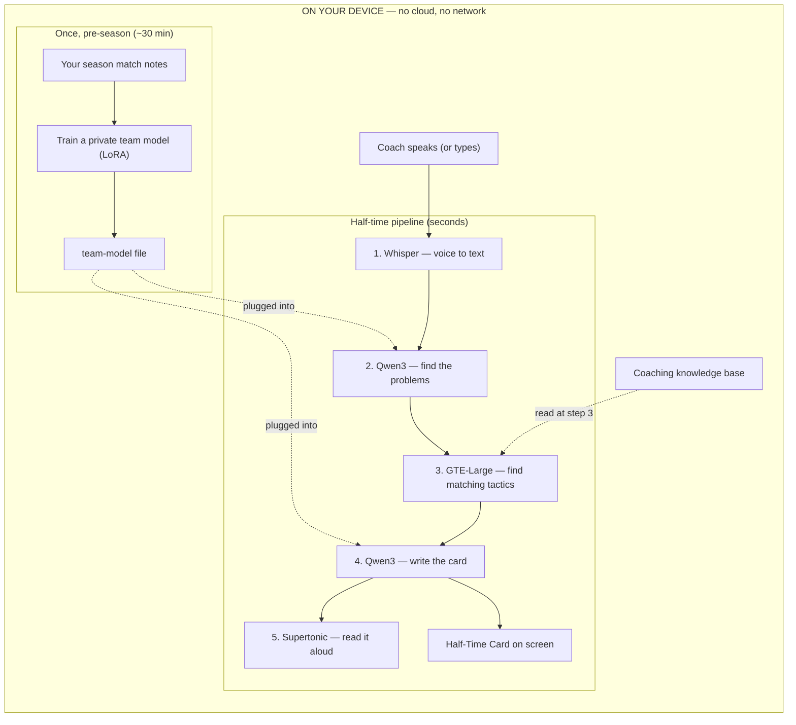
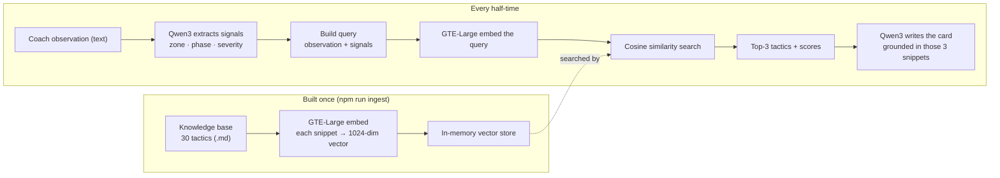
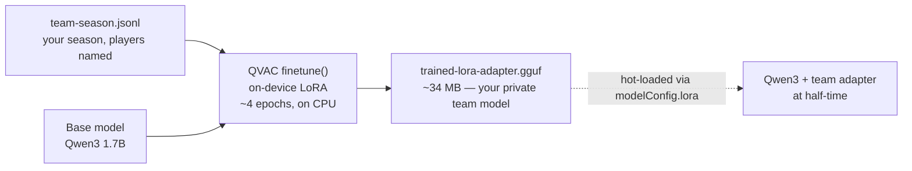
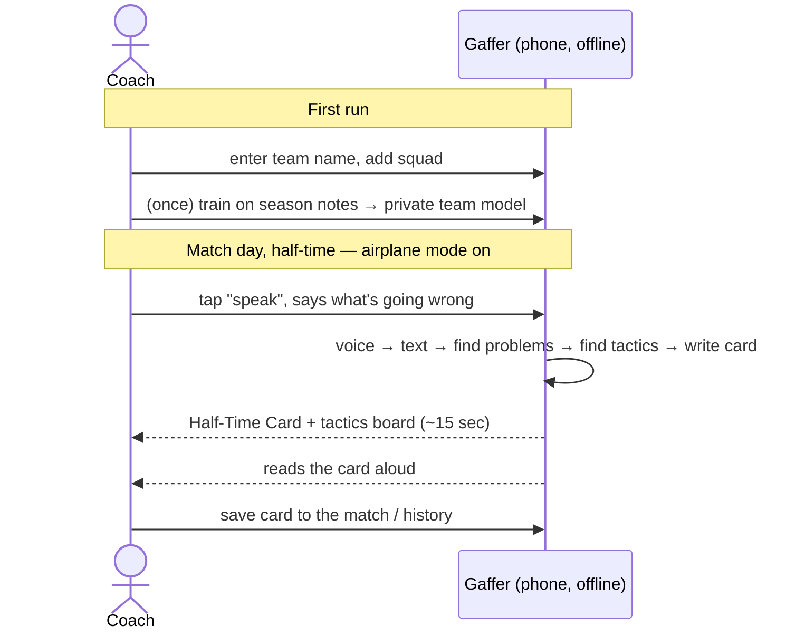

<p align="center">
  
</p>

# Gaffer

**A fully on-device, multimodal RAG system — an offline AI assistant coach for grassroots football. You speak, it hands back a half-time plan — and it never leaves your phone.**

> **Multimodal RAG** — voice/text in → retrieve grounding from a local coaching
> knowledge base → card out as text, speech, and a drawn tactics board. Every
> stage runs on-device through the QVAC SDK.

Built for the **Tether Developers Cup — QVAC (Local AI) track**. Every bit of AI
runs on the device itself through the [QVAC SDK](https://qvac.tether.io). No
cloud, no API keys, no account, no signal needed — put the phone in airplane
mode and it still works.

---

## The problem

Grassroots and youth football coaches are on their own at the touchline.

- **The pro game has analysts.** Grassroots has nothing between a scheduling app
  and an expensive cloud platform — nothing that actually helps with *tactics*.
- **You can't type on a touchline.** It's cold, it's loud, your hands are full,
  and there's often no signal at the pitch.
- **Cloud AI is a non-starter for kids' data.** Sending a youth team's
  performance and video to someone else's server is a privacy problem most clubs
  won't (and shouldn't) touch.

So at half-time, a goal down, the coach has fifteen minutes and no help.

## The solution

Gaffer is a coach in your pocket that works completely offline.

At half-time you **tap and speak** what you're seeing — *"they keep getting at us
down our left and we're losing every second ball in midfield"* — and about
fifteen seconds later you get a **Half-Time Card**: what's hurting you, two or
three concrete changes naming *your* players, and a drill for next training. It
can read the card back to you out loud, and it draws the shape and the movement
on a tactics board.

The clever part: before the season you feed Gaffer a file of your own match notes
and it **trains a small private model of your team, on the device**. After that
the advice stops being generic and starts naming Leo, Aisha and Tom — because it
learned *your* squad, and none of that ever left the phone.

### Real use case

> **Riverside U13, away game, 0–1 down at half-time.**
>
> The coach can't type on a cold touchline with no signal. He taps record and
> mutters: *"They keep getting at us down our left, our right-back's caught too
> high, and we're losing every second ball in midfield."*
>
> Fifteen seconds later, on his phone, with airplane mode on:
>
> ```
> HALF-TIME CARD
>   A goal down and overloaded on our left flank.
>
>   WHAT'S HURTING US
>     - Overload down our left        (getting at us down our left)
>     - Second balls lost in midfield (losing every second ball)
>
>   CHANGES TO MAKE NOW
>     1. Drop Leo to double up on their right winger
>          -> Make it 3-v-3 and stop the overlap
>     2. Push Aisha higher to the contact point
>          -> Be first to the drop
>
>   NEXT TRAINING - DRILL
>     Wide recovery - Leo and Tom defend a 3-v-2 on the wing
>
>   Grounded in: Wide overload on one flank - Losing second balls in midfield
> ```
>
> The advice names **his** players (Leo, Aisha, Tom) because the model was
> fine-tuned on Riverside's season — and none of it left the device.

The pro game has analysts for this. Grassroots has scheduling apps below and
unaffordable cloud platforms above — nothing for tactics. Gaffer fills that gap,
on a phone, offline, for free.

---

## How it works

QVAC's AI runs in Node, not in a browser, so Gaffer has three simple layers: a
web UI you touch, a thin Node server that bridges to the AI, and the QVAC engine
that does all the thinking on-device.

```
┌──────────────────────────────────────────────────────────────┐
│  YOUR DEVICE — nothing below ever talks to the internet       │
│                                                                │
│   Web app (React)                                              │
│     tap-to-speak → microphone → audio                          │
│        │                                                       │
│        ▼   (local HTTP call)                                   │
│   Bridge server (Node + Express)                               │
│        │                                                       │
│        ▼                                                       │
│   QVAC engine  ── all AI, on-device ──────────────────┐        │
│     1. Whisper      turns your voice into text         │        │
│     2. Qwen3        pulls out the tactical problems     │        │
│     3. GTE-Large    finds matching coaching knowledge   │        │
│     4. Qwen3        writes the Half-Time Card           │        │
│     5. Supertonic   reads the card back out loud        │        │
│                                                        │        │
│   Team knowledge base (coaching notes) ──feeds──► step 3        │
│   Your season notes ──trained once──► private team model ─► 2,4 │
└──────────────────────────────────────────────────────────────┘
```

Two things happen at different times:

- **Once, before the season** — you run the training step on your own match
  notes. It produces a small private "team model" file that plugs into Qwen3.
  This is the slow part (~30 min on a laptop), and it only happens once.
- **Every half-time** — voice in, card out, in seconds. Fast because it's a
  single pass through models that are already loaded.

### Architecture (diagram)



## The knowledge base & RAG pipeline

Gaffer doesn't just ask the model to make something up — it **grounds** every
card in a real coaching knowledge base using RAG (Retrieval-Augmented
Generation). This is what stops a small on-device model from hallucinating
tactics.

**What's in the knowledge base.** A hand-written library of **30 grassroots
tactical snippets** in plain coach language — **18 attacking** ideas (overload a
flank, switch the play, third-man runs, play in behind a high line, cut-backs
from the byline…) and **12 defensive** ones (drop and get compact, defend the
counter, protect a lead, defend set-pieces…). It lives as one markdown file
(`data/corpus/tactics.md`) where each `##` heading is one retrievable snippet, so
adding coaching knowledge is just adding a paragraph — no code change.

Here's what two of those snippets actually look like (`data/corpus/tactics.md`):

```markdown
## Attacking — Overload a flank
Create a 2-v-1 or 3-v-2 down one wing by combining the full-back, winger and
near-side midfielder. Draw the defender to the ball, then release the free man
outside or inside him. If they double up to stop it, the switch to the far side
is on — so keep a player wide on the opposite flank.

## Attacking — Switch the point of attack
When the opposition shifts across to crowd one side, the space is on the far
side. Play a quick diagonal to the free winger before the defence can slide over.
The receiver must stay wide and high to stretch the pitch; if they drift inside,
the width — and the advantage — disappears.
```

The full set is 30 like these — plain coach language, no code, no cloud.

**What it retrieves.** For each observation it returns the **top 3 snippets that
best match what the coach described** — matched by *meaning*, not keywords. Say
*"they keep getting at us down our left"* and it pulls "Wide overload on one
flank" even though you never used those words. Each hit comes with a similarity
score, and those three snippets are handed to the model as the only source
material it's allowed to build the card from. That's the "Grounded in:" line at
the bottom of every card.

### RAG pipeline (step by step)



The query isn't just the raw words — Gaffer first has the model pull out
structured **signals** (which zone, which phase of play, how severe), then
searches with the observation *and* those signals combined, which sharpens what
comes back.

**Where it's stored and retrieved from.** All local — nothing is stored remotely:

| | Location |
|---|---|
| Knowledge base (source text) | `data/corpus/tactics.md` (30 markdown snippets) |
| Embedded index (vectors, built once by `npm run ingest`) | `data/cache/rag-index.json` |
| At runtime | the index is loaded into an **in-memory vector store** (`src/rag/store.js`) and searched by a linear cosine scan — instant at this scale, zero setup |

So retrieval reads from a JSON file on disk that you generated locally, held in
memory during a session. The store's interface is just `add()` / `search()`, so
it can later swap to QVAC's HyperDB or a SQLite-vector backend without touching
any caller.

### Multimodal in, multimodal out

The RAG core works on text, but the experience around it is multimodal — which is
the point of a touchline tool:

- **In:** your **voice** (Whisper turns speech into the text query) or typed text.
- **Retrieved:** the matching **text** coaching snippets from the knowledge base.
- **Out:** the card as **on-screen text**, as **spoken audio** (Supertonic reads
  it back), and as a **visual tactics board** (SVG shape + movement arrows).

One spoken sentence goes in; a written, spoken, and drawn plan comes out — all
on-device.

## Learning your team — on-device fine-tuning

RAG gives Gaffer *tactics*. Fine-tuning gives it *your team*. This is the part no
cloud coach can safely offer: it trains a small model of your own squad **on your
own device**, so the advice names your players instead of speaking in generic
textbook terms.

### The training data

You give Gaffer a file of your season — each row is one real half-time moment:
what you saw, and the card a good assistant would have produced, with **your
players named**. The file is `data/training/team-season.jsonl` (one JSON object
per line). One real example (formatted for reading):

```json
{
  "messages": [
    {
      "role": "system",
      "content": "You are Gaffer, assistant coach for Riverside U13. Our squad: Tom (left-back), Kai (right-back), Sam and Daniel (centre-backs), Marcus and Aisha (central midfield), Leo (right wing), Ben (striker). At half-time you produce a Half-Time Card as JSON and you ALWAYS name the specific Riverside players involved."
    },
    {
      "role": "user",
      "content": "They keep getting at us down our left and we are a goal down."
    },
    {
      "role": "assistant",
      "content": "{\"summary\":\"A goal down and overloaded on our left flank.\",\"problems\":[{\"issue\":\"Overload down our left\",\"evidence\":\"getting at us down our left\"}],\"adjustments\":[{\"action\":\"Drop Leo to double up on their right winger\",\"players\":[\"Leo\"]},{\"action\":\"Marcus shuttles across to cover\",\"players\":[\"Marcus\",\"Tom\"]}],\"drill\":{\"name\":\"Wide recovery\",\"description\":\"Leo and Tom defend a 3-v-2 on the wing\"},\"grounding\":[\"Wide overload on one flank\"],\"confidence\":4}"
    }
  ]
}
```

The shipped set is **10 such examples** covering the common half-time situations
(overloads, high line, second balls, protecting a lead, corners, breaking a
low block, fatigue, isolated striker, pressing). `npm run build-dataset`
regenerates it, and you add your own real matches over a season.

### How the fine-tune works



- **LoRA, not full retraining.** Instead of rewriting the whole 1.7B model
  (gigabytes), it trains a tiny set of extra weights — a **LoRA adapter** — that
  layer on top. That's why the output is only ~34 MB and why it can run on a
  laptop CPU.
- **Qwen3 as the base.** Fine-tuning is done on **Qwen3 1.7B** specifically —
  QVAC's fine-tune engine doesn't support the Llama architecture, and a LoRA
  adapter only loads onto a base of the same architecture.
- **On-device and private.** `finetune()` runs the whole forward+backward pass
  locally. Your season notes and your players never leave the machine.
- **Runs once, not per match.** Training is the one slow step (~30 min); it
  happens pre-season or weekly, never in the match-day path.

### The produced model

Training writes one file:

```
data/adapters/trained-lora-adapter.gguf     (~34 MB)
```

At half-time, Gaffer hot-loads that adapter onto Qwen3 (`modelConfig.lora`) so
the exact same pipeline now speaks in **your** squad. Same observation, with vs.
without the adapter:

| | Advice |
|---|---|
| **Base Qwen3** | "Drop a midfielder to double up on the wing and cover the full-back." |
| **+ team adapter** | "Drop **Leo** to double up on their right winger; **Marcus** shuttles across to cover for **Tom**." |

> **Honest caveat:** on a 1.7B model the roster recall isn't perfect and phrasing
> is sometimes clumsy — a model-size trade-off. But the mechanism works
> end-to-end (training loss fell from ~3.5 to ~0.9), and it's the same code path
> a larger on-device model would only do better.

## User flow



## Screens

- **Match** — your team vs the opponent, live score and half, one big
  tap-to-speak button.
- **Capture** — shows it listening, transcribing, and thinking, all on-device.
- **Half-Time Card** — the plan, plus a **tactics board** that picks a formation
  and draws an arrow for each change.
- **Team** — edit your squad and run the one-time training.
- **History** — your real past matches and the cards you saved.

Everything starts empty and is filled with your own team — there is no fake data.
If the engine isn't running, the app tells you to start it rather than inventing
advice.

---

## Tech stack

| Layer | What we use |
|---|---|
| **On-device AI** | [QVAC SDK](https://qvac.tether.io) — the only way any AI runs here |
| Speech-to-text | Whisper (+ Silero voice detection) |
| Reasoning + writing | Qwen3 1.7B, with constrained JSON output |
| Search / RAG | GTE-Large embeddings + cosine similarity |
| Text-to-speech | Supertonic |
| On-device training | LoRA fine-tuning (produces a private team model) |
| Bridge server | Node.js + Express |
| Web app | React 18 + Vite, plain CSS (football theme) |
| Data validation | Zod + JSON-schema constrained decoding |
| Tactics board | Deterministic SVG drawn from the card data |

**Models** come from QVAC's built-in distributed registry (open GGUF weights,
delivered peer-to-peer), download once, then run fully offline.

> **Why the tactics board is drawn by code, not AI:** we tested QVAC's on-device
> image generation — it's great for a crest or a pitch backdrop, but it can't
> draw an *accurate* formation (ask it for a "4-4-2 diamond" and you get random
> players in the wrong spots). A tactics board is a precision problem, so we draw
> it exactly, as SVG, from the card.

## What makes it novel

"AI football coach" isn't a new phrase — but Gaffer combines three things no
existing product ships together:

1. **Fully offline.** Airplane mode, no signal, no account. The whole pipeline —
   voice, reasoning, search, and speech — runs on the device.
2. **Private by design.** A youth team's data never touches a server, so it's
   safe for exactly the people cloud tools can't serve.
3. **It learns *your* team.** The training step builds a private model of your
   own squad on your own device, so the advice names your players and your
   patterns instead of generic textbook tactics.

Offline + private + personalised-on-device is the combination — and it's only
possible *because* the AI runs locally through QVAC.

---

## Setup

Requires **Node.js ≥ 22.17** (a QVAC SDK requirement).

```bash
npm install
cp .env.example .env
npm run precache       # download the models once (a few GB) while you have signal
npm run ingest         # build the coaching knowledge index
```

### Run the full app (voice UI)

Two terminals — the engine bridge and the web app:

```bash
# terminal 1 — the on-device engine (serves the app on port 8787)
npm run server

# terminal 2 — the web app
cd web && npm install && npm run dev     # http://localhost:5173
```

Open **http://localhost:5173**, enter your team name, add your squad on the
**Team** page, then on the **Match** page tap **speak** and describe what's going
wrong. It transcribes → advises → shows the Half-Time Card and tactics board, and
"Read aloud" speaks it back — all on-device.

### Train the private team model (the differentiator)

Slow, and only needed once:

```bash
npm run build-dataset  # turn your season notes into a training file
npm run finetune       # train the private team model (~30 min on CPU)
npm run demo:team      # advice that names your own players
```

### Command line (engine only, no UI)

```bash
node src/index.js "they're overloading our left and we're a goal down"
node src/index.js --demo             # scripted example
node src/index.js --adapter --demo   # use the trained team model
node src/index.js --voice clip.wav   # transcribe a WAV, then advise
node src/index.js --speak "..."      # also read the card aloud
```

The first model load downloads weights from the QVAC registry; after that it's
fully offline. The very first load in a fresh process can occasionally hit a
worker cold-start timeout — the engine retries by itself.

---

## Status

Working end-to-end, entirely on-device:

- **Engine** — voice/text → problems → matching tactics → Half-Time Card.
- **Voice** — Whisper (in) and Supertonic (out) verified round-trip.
- **Bridge** — `/health`, `/session`, `/tts`, `/transcribe` live.
- **Web app** — React football UI, live voice in and out, dynamic tactics board.
- **Training** — on-device LoRA completes and shifts the advice toward your
  named players.

**Known limitation:** on a small on-device model (1.7B) the card wording is
occasionally clumsy — a model-size trade-off, not an integration gap. Desktop
Node is the build target for this sprint; the same QVAC code path targets
iOS/Android for a future mobile build.

## License

Licensed under the **Apache License 2.0** — see [LICENSE](LICENSE).
