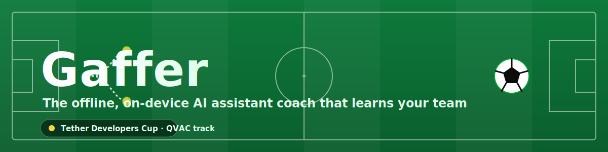
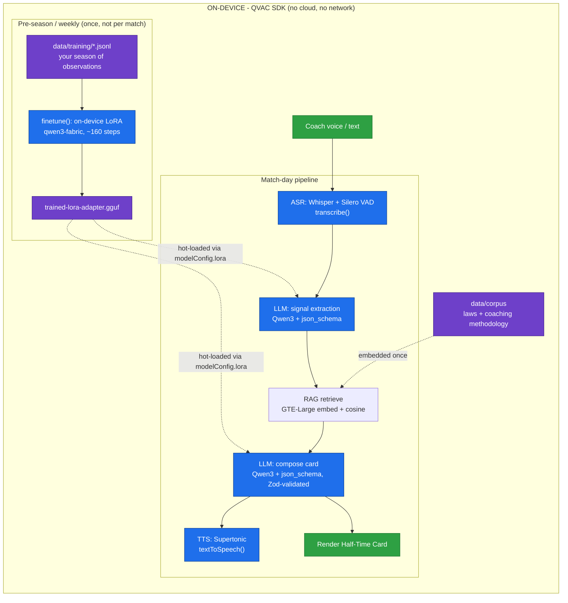
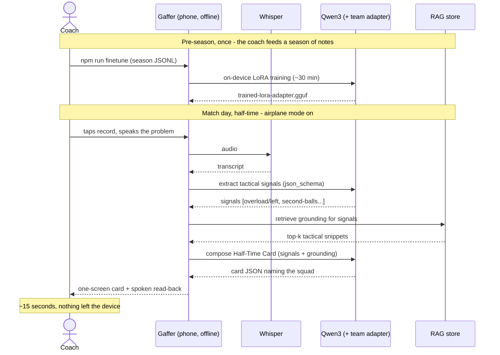

<p align="center">
  
</p>

# Gaffer

**The offline, on-device AI assistant coach that learns your team.**

Built for the **Tether Developers Cup - QVAC (Local AI) track**. Every piece of AI
runs on-device through the [QVAC SDK](https://qvac.tether.io): no cloud, no API
keys, no data leaving the machine. A grassroots coach speaks their touchline
observations; at the break Gaffer hands back a **Half-Time Card** - a one-screen
tactical adjustment plus a fix-it drill - grounded in a local knowledge base and
**personalised to your own squad** via on-device fine-tuning.

> The category "AI football coach" is not new. Gaffer's edge is the combination
> no existing product ships: **fully offline + privacy-first + a model that
> trains a private LoRA adapter on _your_ season, on _your_ device.**

## Why it's defensible
- **Offline + private** - youth performance data never touches a server. Cloud
  incumbents (e.g. FootballGPT) can't make that claim.
- **Learns your team** - `finetune()` produces a `.gguf` adapter from your season
  of observations; the base model gives generic advice, the team adapter speaks
  in your own players and patterns.
- **Voice-first** - you can't type on a touchline. Speak; get a spoken card back.

## Real use case

> **Riverside U13, away game, 0-1 down at half-time.**
>
> The coach can't type on a cold touchline with no signal. He taps record and
> mutters: *"They keep getting at us down our left, our right-back's caught too
> high, and we're losing every second ball in midfield."*
>
> Fifteen seconds later, on his phone, with airplane mode on:
>
> ```
> HALF-TIME CARD
>   A goal down and overloaded on our left flank.
>
>   WHAT'S HURTING US
>     - Overload down our left        (getting at us down our left)
>     - Second balls lost in midfield (losing every second ball)
>
>   CHANGES TO MAKE NOW
>     1. Drop Leo to double up on their right winger
>          -> Make it 3-v-3 and stop the overlap
>     2. Push Aisha higher to the contact point
>          -> Be first to the drop
>
>   NEXT TRAINING - DRILL
>     Wide recovery - Leo and Tom defend a 3-v-2 on the wing
>
>   Grounded in: Wide overload on one flank - Losing second balls in midfield
> ```
>
> The advice names **his** players (Leo, Aisha, Tom), because the model was
> fine-tuned on Riverside's season - and none of it left the device.

The pro game has analysts for this. Grassroots has admin apps (scheduling,
payments) below and unaffordable cloud platforms above - nothing for tactics.
Gaffer fills that gap, on a phone, offline, for free.

## Architecture (Mermaid)



## User flow (Mermaid)



### How it runs (three tiers)
QVAC only runs in Node, not the browser — so the app is a **React UI ↔ a thin
Node bridge ↔ the QVAC engine**. The UI is a pure skin; all AI stays in Node,
on-device.

```
Browser UI (web/, Vite + React, football theme)
   │   hold-to-speak → mic → 16 kHz WAV
   ▼   fetch /api (Vite proxies → :8787)
Bridge server (src/server.js, Express)
   │   /transcribe · /session · /tts · /health   (serialized model loads)
   ▼
QVAC engine (src/core/engine.js — the only SDK importer)
   Whisper · Qwen3(+adapter) · GTE-Large RAG · Supertonic — all on-device
```

The layering keeps the QVAC SDK touched in exactly one place
(`src/core/engine.js`); the football logic stays pure and testable.

### Module map
| Path | Responsibility |
|---|---|
| `src/config/models.js` | All model constants + runtime config in one place |
| `src/core/engine.js` | QVAC lifecycle: init / load / unload / shutdown (only SDK importer) |
| `src/capabilities/*` | Thin, typed wrappers over QVAC SDK functions (llm, embed, asr, tts, finetune) |
| `src/rag/*` | Embedding-backed vector store + retriever (SDK-agnostic) |
| `src/domain/*` | Football logic, prompts, Zod + JSON schemas, Card rendering (no SDK) |
| `src/pipeline/matchSession.js` | Orchestrates the end-to-end flow |
| `src/server.js` | HTTP bridge exposing the engine to the browser |
| `web/` | React + Vite frontend (football theme) |
| `web/src/components/TacticsBoard.jsx` | Dynamic, data-driven pitch + formation + movement arrows |
| `web/src/lib/*` | API client, mic recorder (→16 kHz WAV), card→speech, board derivation |
| `scripts/*` | Model pre-cache, corpus ingest, dataset build, fine-tune, voice/image probes |
| `data/corpus/` | Tactical knowledge base (RAG source) |
| `data/training/` | Season observations (fine-tune source) |

### Frontend
Mobile-first, football-themed (Floodlit + Daylight themes, booking-card severity
colours, matchday-condensed type). Pages: **Match** (hold-to-speak), **Capture**
overlay (live transcription + signals), **Half-Time Card** (renders the engine's
JSON) with a **dynamic tactics board** that auto-picks the formation and draws a
movement arrow per adjustment, **Team** (squad + on-device train + before/after),
and **History**. If the bridge isn't running it falls back to sample data so the
UI still demos.

## Models
All models resolve from the QVAC distributed registry (open GGUF weights,
originally from Hugging Face, delivered over QVAC's peer-to-peer Hypercore) and
run on-device.

| Role | Model | Notes |
|---|---|---|
| Reasoning + fine-tune base | `QWEN3_1_7B_INST_Q4` | Qwen3 is required for fine-tuning; the QVAC finetune engine does not support the llama architecture, and a LoRA adapter only loads onto a base of the same architecture. |
| Embeddings (RAG) | `GTE_LARGE_FP16` | 1024-dim vectors |
| Speech-to-text | `WHISPER_TINY` | + Silero VAD for live mic |
| Text-to-speech | `TTS_EN_SUPERTONIC_Q8_0` | 44.1 kHz PCM |
| Image gen (optional) | `SDXL_BASE_1_0_3B_Q4_0` / `SD_V2_1_1B_Q4_0` | cosmetic only — team crest / pitch backdrop |

Structured output uses QVAC's constrained `json_schema` response format, so even a
small on-device model cannot emit an out-of-enum value or omit a required field;
Zod then validates defensively after parsing.

### On image generation (why the tactics board is SVG, not AI)
QVAC's `diffusion()` runs image models on-device (tested on the Intel Arc GPU via
Vulkan; SDXL fits 2 GB with `offload_to_cpu`). It's great for **cosmetic** output
— a team crest or a pitch backdrop. But it **cannot draw an accurate formation**:
prompted for a "4-4-2 diamond" it produces the *look* of a tactics board with the
wrong number of players in random spots (it even rendered "diamond" as gemstones).
A tactics board is a *precision* problem, not an art one, so it's drawn
deterministically as **SVG** from the card data. Diffusion is reserved for the
crest/backdrop.

## Performance note
Everything except training is interactive (seconds): model load is a cached
one-time download, RAG ingest is a handful of embeds, and a Half-Time Card is a
single inference pass. **On-device fine-tuning is the only heavy step** - a full
forward+backward over a 1.7B model on CPU, ~160 steps, roughly half an hour. It
runs once per season (or weekly), not per match, so it never sits in the
match-day path.

## Setup
Requires **Node.js >= 22.17** (QVAC SDK requirement).

```bash
npm install
cp .env.example .env
npm run precache       # pre-download models (gigabytes) before going offline
npm run ingest         # build the RAG index from data/corpus
npm run demo           # generic advice (base model)

# the differentiator (slow, once per season):
npm run build-dataset  # generate the team training set from scripts/build-dataset.js
npm run finetune       # train the team LoRA adapter (~30 min on CPU)
npm run demo:team      # advice that names your own players (uses the adapter)
```

The first model load downloads weights from the QVAC registry; after that it runs
fully offline. The first `loadModel` of a process can occasionally hit a worker
cold-start timeout - the engine retries automatically.

### CLI (engine only)
```bash
node src/index.js "they're overloading our left and we're a goal down"
node src/index.js --demo            # scripted demo observation
node src/index.js --adapter --demo  # use the fine-tuned team adapter
node src/index.js --voice clip.wav  # transcribe a WAV, then advise
node src/index.js --speak "..."     # also synthesize a spoken card (data/cache/*.wav)
```

### Run the full app (UI + voice)
Two processes — the bridge (Node/engine) and the Vite UI:

```bash
# terminal 1 — engine bridge (warms the worker, then serves /api on :8787)
npm run server

# terminal 2 — football-themed UI (proxies /api to the bridge)
cd web && npm install && npm run dev   # http://localhost:5173
```

Open **http://localhost:5173**, allow the microphone, and hold-to-speak: it
transcribes (Whisper) → advises (RAG + Qwen3) → renders the Half-Time Card and
tactics board → "Read aloud" speaks it back (Supertonic). All on-device.

Handy probes: `node scripts/test-voice.js` (TTS→ASR round-trip),
`node scripts/test-diffusion.js` (image-model output).

## Status
Working end-to-end, on-device:
- **Engine** — observation → tactical signals → RAG grounding → Half-Time Card.
- **Voice** — Whisper (STT) + Supertonic (TTS) downloaded and verified (TTS→ASR
  round-trip returns the input text).
- **Bridge** — `/health`, `/session`, `/tts`, `/transcribe` all live; model loads
  serialized so concurrent requests don't race the single Bare worker.
- **Frontend** — React football UI wired to the bridge (live voice in/out) with a
  dynamic tactics board driven by the card data.
- **Fine-tuning** — on-device LoRA completes and produces a team adapter that
  shifts card output toward named players.

Known limitation: on the small on-device LLM (1.7B) card phrasing is occasionally
clumsy — an inherent model-size trade-off, not an integration gap. Mobile (Expo)
is a stretch — the same QVAC code targets iOS/Android, but desktop Node is the
build target for the sprint (no mobile emulator support).

## License
Apache-2.0.
